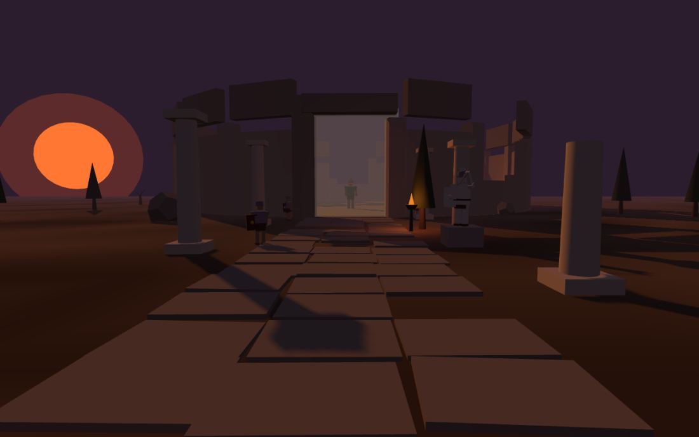
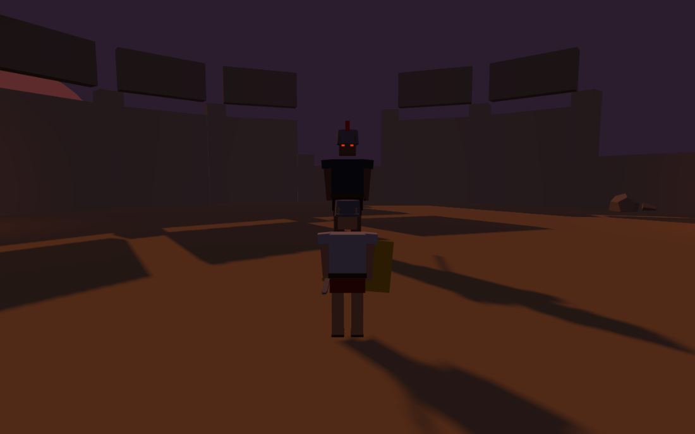

# ⚔️ IMPERIVM AETERNVM

> *L'impero è caduto — la sua ombra ti attende.*

Un **souls-like 3D** ambientato tra le rovine dell'Impero Romano, ispirato a Elden Ring.
Scritto interamente in **JavaScript + Three.js**, senza asset esterni: ogni personaggio,
rovina, suono e animazione è **generato proceduralmente** dal codice.

*(English: a 3D souls-like set in the ruins of the Roman Empire, built with Three.js.
Zero dependencies, zero assets — everything is procedural. Run any static server and play.)*



## 🏛️ Come si gioca

Sei un legionario senza nome, richiamato tra le ceneri di Roma. Percorri la **Via Sacra**,
abbatti i legionari corrotti che la pattugliano, riposa al **Sacrarium** e affronta il
guardiano del Colosseo: **CENTVRIO INVICTVS, CVSTOS AETERNVS**.



### Meccaniche souls-like

- ⚡ **Stamina**: attacchi, schivate e corsa consumano stamina — gestiscila o morirai
- 🤸 **Schivata con i-frames**: la capriola ti rende invulnerabile nei frame centrali
- ⚔️ **Attacco leggero e pesante**, con combo concatenabili e roll-cancel
- 🎯 **Lock-on** sul bersaglio più vicino
- 🏺 **Vinum Sacrum**: 4 fiaschette curative, ricaricate al Sacrarium
- 🔥 **Sacrarium** (il "falò"): riposare cura, ricarica le fiaschette, **fa rinascere i nemici** e apre il pannello di crescita
- 💀 **Morte alla Dark Souls**: perdi tutta la **Gloria** dove sei morto — torna a riprenderla, ma se muori di nuovo prima di recuperarla è persa per sempre (*MORTVVS ES*)
- 📈 **Level-up**: offri Gloria al Sacrarium per aumentare **Vigor** (salute), **Industria** (stamina) o **Virtus** (danno)
- 👹 **Boss a due fasi**: sotto il 50% di vita il Centurione si infuria — più veloce, e aggiunge un balzo con onda d'urto
- 💾 **Salvataggio automatico** (localStorage) di statistiche, Gloria e boss sconfitto

## 🕹️ Comandi

| Tasto | Azione |
|---|---|
| `W A S D` | Movimento |
| `Mouse` | Telecamera |
| `Shift` | Corsa |
| `Spazio` | Schivata (capriola) |
| `Click sinistro` | Attacco leggero (combo) |
| `Click destro` | Attacco pesante |
| `Q` | Aggancia/sgancia bersaglio |
| `F` | Bevi il Vinum Sacrum |
| `E` | Interagisci (riposa / recupera Gloria) |
| `1 / 2 / 3` | Level-up mentre riposi |
| `Esc` | Pausa |
| `N` (nel titolo) | Cancella il salvataggio |

## 🚀 Come avviarlo in locale

Serve solo un static server (i moduli ES non funzionano aprendo il file direttamente).
Three.js è già incluso nel repository (`lib/three.module.js`): **funziona anche offline**.

```bash
git clone https://github.com/SonoKarol/imperium-aeternum.git
cd imperium-aeternum

# una qualsiasi di queste:
npx http-server -p 8080        # Node
python -m http.server 8080     # Python
# oppure l'estensione "Live Server" di VS Code
```

Poi apri **http://localhost:8080** nel browser e clicca per iniziare.

## 🧱 Architettura

```
index.html          HUD (HTML/CSS), schermata del titolo, import map
lib/
  three.module.js   Three.js r160 (vendorizzato — nessuna dipendenza)
src/
  main.js           Game loop, stati di gioco, Sacrarium, morte/respawn, trigger del boss
  world.js          Mondo procedurale: Via Sacra, tempio, Colosseo, luci, collisioni
  characters.js     Rig umanoidi procedurali + sistema di pose/animazioni
  player.js         Controller in terza persona, camera, stamina, combo, lock-on
  enemies.js        IA dei nemici (pattuglia → inseguimento → attacco → stordimento)
  boss.js           Centurio Invictus: combo, carica, schianto, enrage
  fx.js             Particelle (sangue, scintille, polvere, anime) e onda d'urto
  audio.js          Audio 100% sintetizzato con WebAudio (niente file)
  hud.js            Barre, messaggi in latino, boss bar, pannello level-up
  input.js          Tastiera + mouse con pointer lock
```

Scelte tecniche degne di nota:

- **Tutto procedurale**: i personaggi sono gerarchie di primitivi con pivot alle spalle/anche;
  le animazioni (camminata, attacchi, capriola, morte) sono funzioni di posa stateless valutate ogni frame.
- **Combattimento**: hitbox a cono (distanza + angolo) attive solo nella finestra di colpo
  dell'animazione, con poise/stordimento sui nemici.
- **Mondo deterministico**: il generatore usa un PRNG seedato, quindi le rovine sono identiche per tutti.
- **Audio sintetizzato**: ogni suono (fendenti, ferite, tamburi di guerra del boss, vento)
  è generato con oscillatori e rumore filtrato WebAudio.

## 📜 Licenza

[MIT](LICENSE) — *Gloria Aeterna.*
