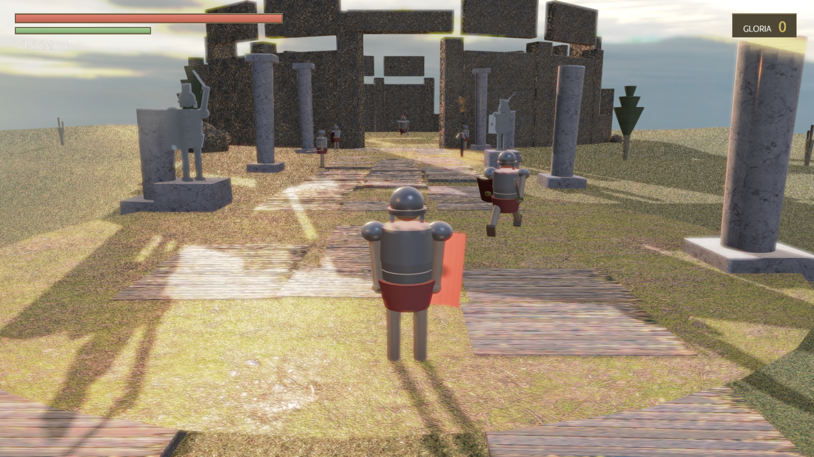
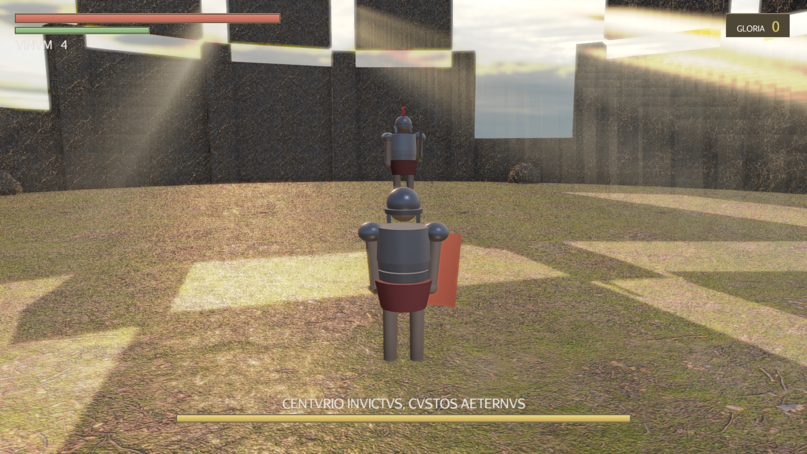
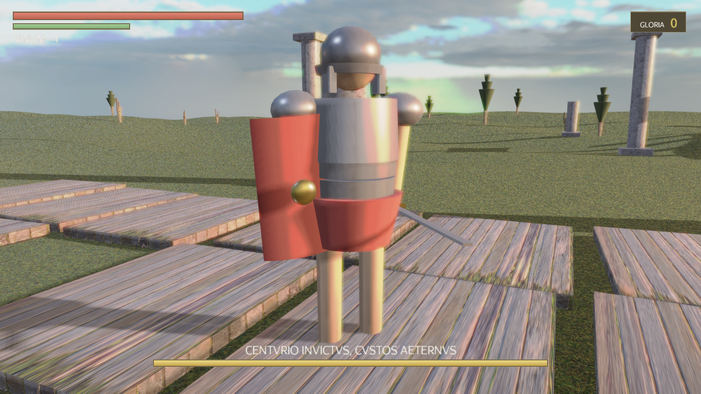
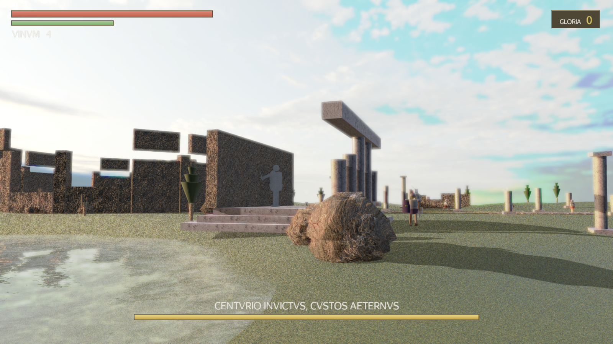

# ⚔️ IMPERIVM AETERNVM

> *L'impero è caduto — la sua ombra ti attende.*

Un **souls-like 3D** ambientato tra le rovine dell'Impero Romano, ispirato a Elden Ring.
Scritto in **Java** con **jMonkeyEngine 3.7** e una pipeline di resa realistica:
materiali **PBR** con texture fotografiche, cielo **HDRI** al tramonto, ombre in cascata,
**SSAO**, bloom, **god rays**, acqua riflettente e tone mapping filmico.

*(English: a 3D souls-like set in the ruins of the Roman Empire — Java + jMonkeyEngine,
realistic PBR rendering with photo textures, HDRI sunset sky, cascaded shadows, SSAO,
bloom, god rays and reflective water. Build & run locally with `gradlew run`.)*





## 🚀 Come si avvia

Serve solo un **JDK 17 o superiore** ([Adoptium](https://adoptium.net/)). Tutto il resto
(jMonkeyEngine, LWJGL, le librerie native) viene scaricato automaticamente da Gradle.

```bash
git clone https://github.com/SonoKarol/imperium-aeternum.git
cd imperium-aeternum

# Windows
gradlew.bat run

# Linux / macOS
./gradlew run
```

## 🏛️ Il gioco

Sei un legionario senza nome, richiamato tra le ceneri di Roma. Percorri la **Via Sacra**,
abbatti i legionari corrotti, riposa al **Sacrarium** e affronta il guardiano del
Colosseo: **CENTVRIO INVICTVS, CVSTOS AETERNVS**.

|  |  |
|---|---|

### Meccaniche souls-like

- ⚡ **Stamina**: attacchi, schivate e corsa la consumano — gestiscila o morirai
- 🤸 **Schivata con i-frames**: la capriola ti rende invulnerabile nei frame centrali
- ⚔️ **Attacco leggero e pesante**, combo concatenabili e roll-cancel
- 🎯 **Lock-on** sul bersaglio
- 🏺 **Vinum Sacrum**: 4 fiaschette curative, ricaricate al Sacrarium
- 🔥 **Sacrarium** (il "falò"): riposare cura, ricarica le fiaschette, **fa rinascere i nemici** e apre il pannello di crescita
- 💀 **Morte alla Dark Souls**: perdi tutta la **Gloria** dove sei morto — torna a riprenderla, ma se muori di nuovo prima è persa per sempre (*MORTVVS ES*)
- 📈 **Level-up**: offri Gloria per aumentare **Vigor** (salute), **Industria** (stamina) o **Virtus** (danno)
- 👹 **Boss a due fasi**: sotto il 50% il Centurione si infuria — più veloce, carica e schianto con onda d'urto
- 💾 **Salvataggio automatico** (`~/.imperium-aeternum.properties`)

### Comandi

| Tasto | Azione |
|---|---|
| `W A S D` | Movimento |
| `Mouse` | Telecamera |
| `Shift` | Corsa |
| `Spazio` | Schivata (capriola) |
| `Click sinistro` | Attacco leggero (combo) |
| `Click destro` | Attacco pesante |
| `Q` | Aggancia/sgancia bersaglio |
| `F` | Bevi il Vinum Sacrum |
| `E` | Interagisci (riposa / recupera Gloria) |
| `1 / 2 / 3` | Level-up mentre riposi |
| `Esc` | Pausa |
| `N` (nel titolo) | Cancella il salvataggio |

## 🎨 La grafica realistica

- **PBR ovunque** (`PBRLighting`): metalli sull'armatura, marmo, roccia e terreno con
  mappe colore/normali/roughness fotografiche **CC0 da [ambientCG](https://ambientcg.com)**
  (Grass004, Ground037, Rock030, Marble012, PavingStones070, Bark007)
- **Cielo HDRI** al tramonto (*evening road pure sky*, **CC0 da [Poly Haven](https://polyhaven.com)**),
  con **light probe IBL** generata a runtime + luci di riempimento cielo/rimbalzo
- **Ombre direzionali in cascata** 4×4096 con PCF Poisson
- **God rays** (light scattering) dal sole basso dietro il Colosseo
- **SSAO**, **bloom** HDR, **FXAA** e **tone mapping** filmico
- **Acqua riflettente** (WaterFilter) nel lago accanto al tempio in rovina
- Terreno **procedurale analitico** (colline, depressione del lago, zone di gioco spianate)
- Personaggi procedurali articolati con pose animate al frame (niente modelli esterni)
- Audio **interamente sintetizzato** in `javax.sound.sampled` — niente file audio

`gradlew run -Pshot=true` esegue una modalità verifica che salva screenshot in `shots/` ed esce.

## 🧱 Architettura

```
build.gradle              Gradle + jME 3.7 (jme3-core/desktop/lwjgl3/effects)
src/main/java/aeternum/
  Main.java               Bootstrap, pipeline di resa (probe, ombre, SSAO, bloom, rays, acqua)
  GameState.java          Flusso di gioco: titolo, Sacrarium, morte/Gloria, trigger boss
  World.java              Mondo procedurale + collisioni a cerchi
  Rig.java / Poses.java   Personaggi procedurali + pose/animazioni stateless
  PlayerCtrl.java         Controller terza persona, stamina, combo, lock-on, camera
  Enemy*.java / Boss.java IA nemici e boss a due fasi
  Hud.java                HUD (barre, messaggi in latino, boss bar, level-up)
  Fx.java                 Particelle (sangue, polvere, anime), fuochi, onda d'urto
  SynthAudio.java         Sintetizzatore software (toni + rumore filtrato)
  Save.java / TexLib.java Salvataggio e libreria materiali PBR
src/main/resources/       Texture PBR + HDRI (tutte CC0)
web/                      Il prototipo originale in JavaScript + Three.js (storico)
docs/JAVA-SPEC.md         La specifica usata per il porting
```

## 📜 Licenza e crediti

Codice: [MIT](LICENSE). Texture e HDRI: **CC0** (public domain) da
[ambientCG](https://ambientcg.com) e [Poly Haven](https://polyhaven.com) — grazie!

*Gloria Aeterna.*
